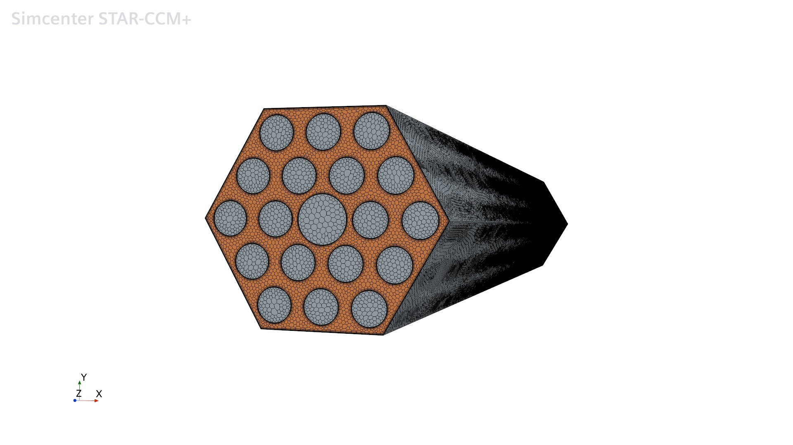
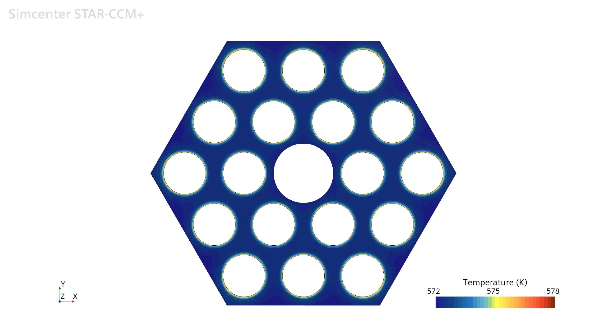
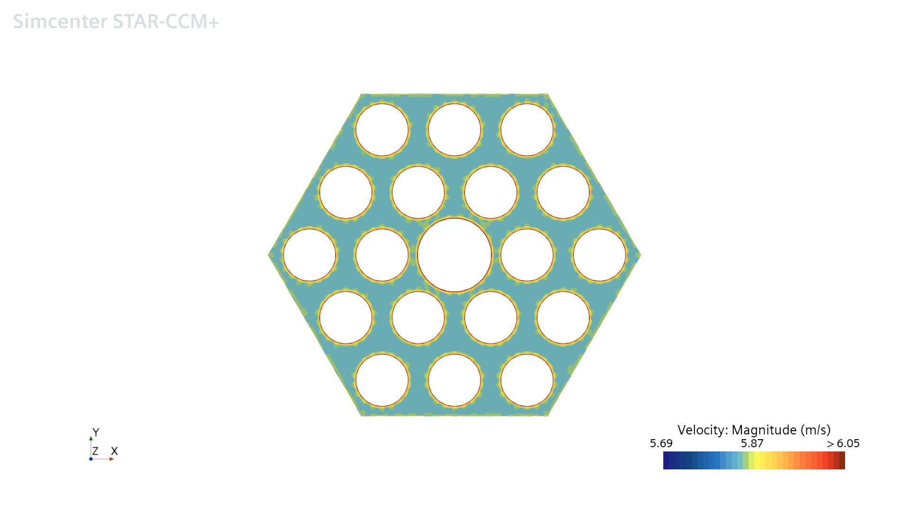

# Single-Phase CFD Simulation of a VVER-1200 Fuel Rod Bundle

Conjugate heat transfer (CHT) CFD study of a **19-rod hexagonal mini-bundle** from a
**VVER-1200 (V-392M)** fuel assembly, run in **Simcenter STAR-CCM+**. The model couples
solid-rod conduction with turbulent coolant flow over a 37.5 cm axial slice (the bottom
1/10 of the active core) under a sinusoidal axial power source, and the integrated
results are cross-checked against analytical correlations.

*Course project — NEM 358, Department of Nuclear Engineering, Hacettepe University.*



> Polyhedral volume mesh of the 19-rod hexagonal mini-bundle (18 fuel rods + 1 central
> guide tube), with prism layers on every solid surface.

---

## Key results — CFD vs. analytical

| Quantity | CFD (Star-CCM+) | Analytical reference | Difference |
|---|---|---|---|
| Pressure drop, ΔP | 9728.6 Pa | 10 590.7 Pa (Rehme correlation) | **8.1 %** |
| Coolant temperature rise, ΔT | 1.033 K | 1.053 K (energy balance) | **1.9 %** |
| Peak fuel temperature, T<sub>max</sub> | 770.4 K | 769.0 K (1-D conduction) | **0.18 %** |

All three figures of merit land within ~9 % of independent analytical estimates; the
energy-balance match (1.9 %) is essentially a conservation check, and the peak-temperature
match (0.18 %) is excellent because the full-hexagon geometry cools every rod around its
entire circumference — exactly the assumption of the 1-D cylindrical conduction formula.

---

## Problem setup

**Geometry.** A 19-rod hexagonal mini-bundle: 18 fuel rods + 1 central guide tube,
rod pitch *P* = 12.75 mm, rod OD 9.1 mm, guide-tube OD 12.9 mm. Axial length
*L* = 0.375 m (*z* = 0 is the inlet). Hydraulic diameter *D<sub>h</sub>* = 7.974 mm,
flow area *A<sub>flow</sub>* = 1.500 × 10⁻³ m².

**Power.** Core-average volumetric heat rate q̄‴ = 3.698 × 10⁸ W/m³ with a sinusoidal
axial shape q‴(z) ∝ sin(πz / H<sub>f</sub>) over the full 3.75 m core height, so the
modeled bottom slice starts from near-zero power at the inlet. Outer-ring rods carry a
power factor 0.97, inner-ring rods 0.88, guide tube 0.

**Physics & BCs.**
- Steady, segregated flow + segregated energy
- **SST k-ω turbulence with γ-Reθ transition**
- Constant-density liquid water at 15.51 MPa / 309.4 °C (Ri ∼ 10⁻⁴), gravity included
- Conjugate heat transfer across all 19 fluid–solid interfaces
- Inlet: velocity 5.842 m/s, 571.35 K, 4 % turbulence intensity → **Re ≈ 3.88 × 10⁵**
- Outlet: pressure outlet (0 Pa gauge); outer hexagon wall adiabatic

**Mesh.** Polyhedral core mesh, base size 2 mm, 6 prism layers (1 mm total, stretch 1.3)
on every solid wall, ≈ 1.7–1.8 × 10⁶ cells. The run converged in 358 iterations with all
residuals below 10⁻³.

---

## Selected results

| Temperature contour (outlet) | Velocity magnitude (outlet) |
|---|---|
|  |  |

The temperature field shows a thin warm ring around each heated fuel rod and a cool
central guide tube (no heat source). The velocity field is uniform in the bulk and peaks
in the narrow inter-rod gaps — the expected rod-bundle flow pattern.

Diagonal line-probe and axial-profile plots (temperature, pressure, velocity) and the
pressure contour are in [`docs/figures`](docs/figures).

---

## Repository contents

```
docs/
  VVER-1200_Rod_Bundle_CFD_Report.pdf   full project report
  figures/                              all contour and probe figures
field_functions.txt                     Star-CCM+ heat-generation field functions
```

The full methodology, all derivations (hydraulic diameter, Rehme friction factor, 1-D
conduction peak temperature) and the complete result discussion are in the
[project report](docs/VVER-1200_Rod_Bundle_CFD_Report.pdf).

---

## References

1. Hacettepe University, Dept. of Nuclear Engineering — *NEM 358 Final Project
   Description and VVER-1200 Design Data Sheet*, 2026.
2. K. Rehme, *Pressure drop correlations for fuel element spacers*, Nuclear Technology
   **17**, 1973.
3. Siemens Digital Industries Software, *Simcenter STAR-CCM+ User Guide*.
4. N. E. Todreas, M. S. Kazimi, *Nuclear Systems Vol. I: Thermal Hydraulic
   Fundamentals*, 2nd ed., CRC Press, 2011.

## License

MIT — see [LICENSE](LICENSE). The report PDF and figures are part of an academic course
project and are shared for portfolio purposes.
